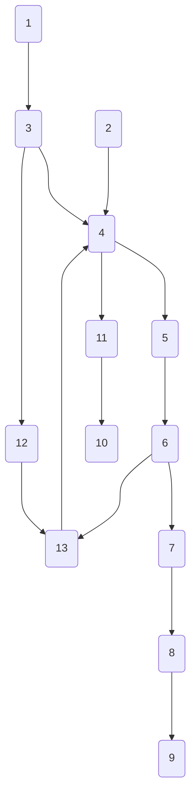
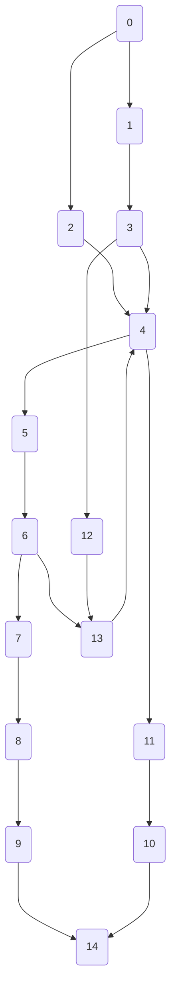

# file 01 en entrée

```mermaid  
graph TD
   T1(1) ---> T3(3)
   T2(2) ---> T4(4)
   T3 ---> T4
   T3 ---> T12(12)
   T4 ---> T5(5)
   T4 ---> T11(11)
   T5 ---> T6(6)
   T6 ---> T7(7)
   T6 ---> T13(13)
   T7 ---> T8(8)
   T8 ---> T9(9)
   T11 ---> T10(10)
   T12 ---> T13
   T13 ---> T4  
```

# file 01 après construction du graph

```mermaid  
graph TD
	T0(0) ---> T1(1)
	T0 ---> T2(2)
	T1 ---> T3(3)
	T2 ---> T4(4)
	T3 ---> T4
	T3 ---> T12(12)
	T4 ---> T5(5)
	T4 ---> T11(11)
	T5 ---> T6(6)
	T6 ---> T7(7)
	T6 ---> T13(13)
	T7 ---> T8(8)
	T8 ---> T9(9)
	T9 ---> T14(14)
	T10(10) ---> T14
	T11 ---> T10
	T12 ---> T13(13)
	T13 ---> T4  
```
